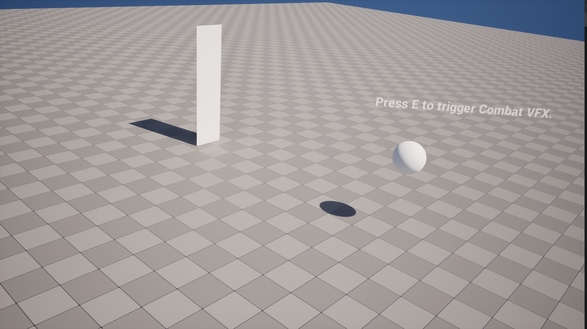
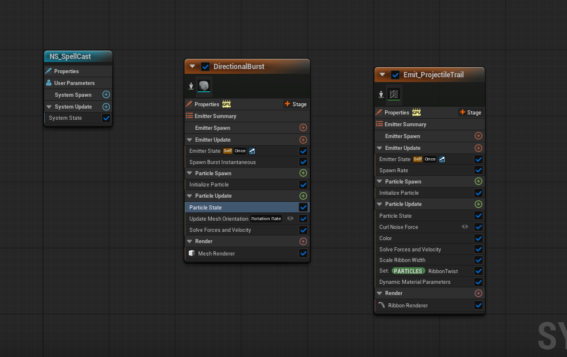
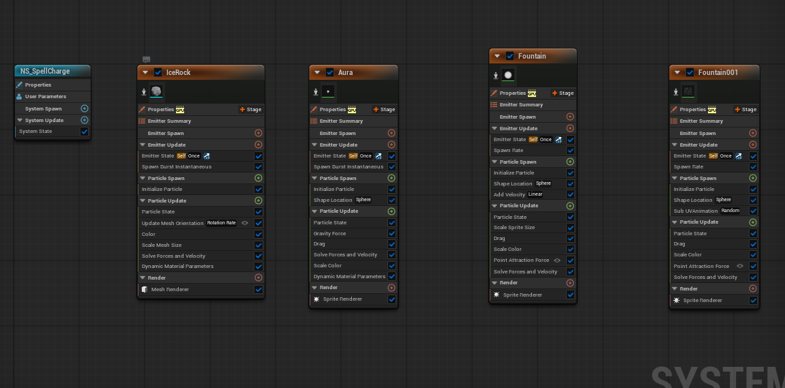
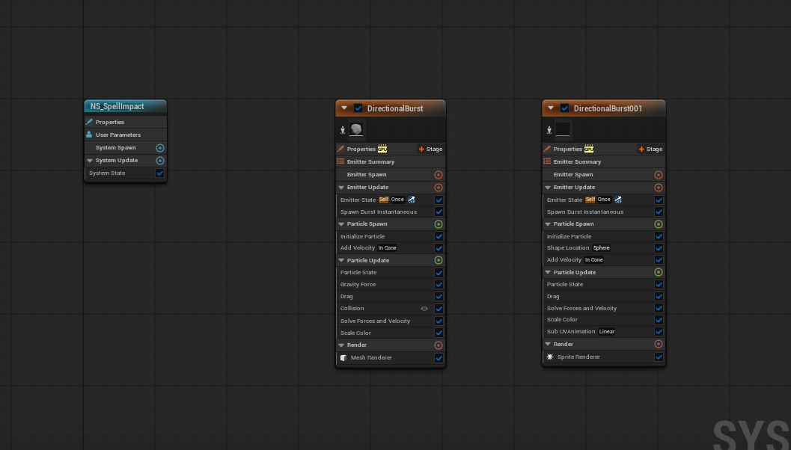
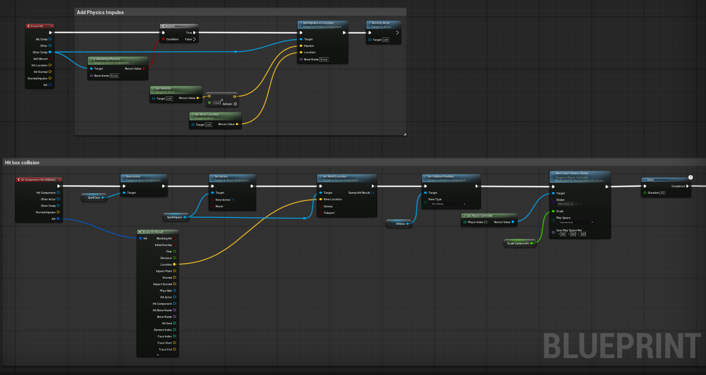
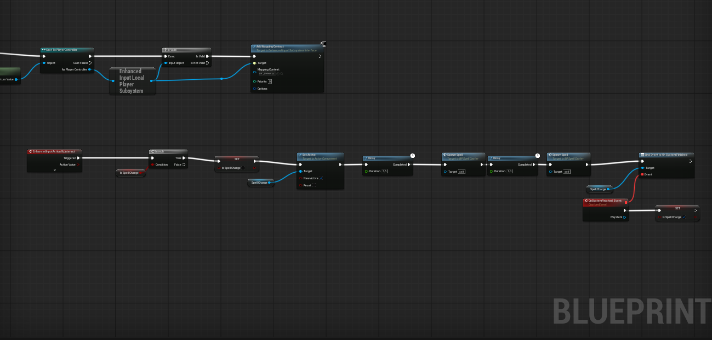
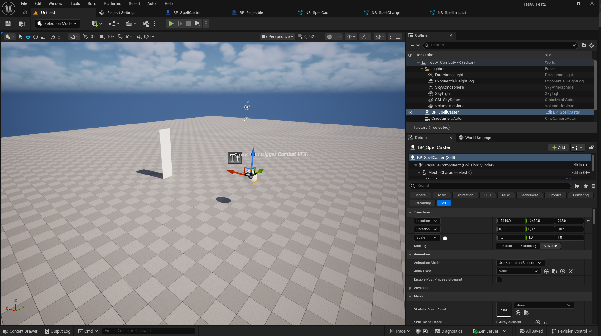
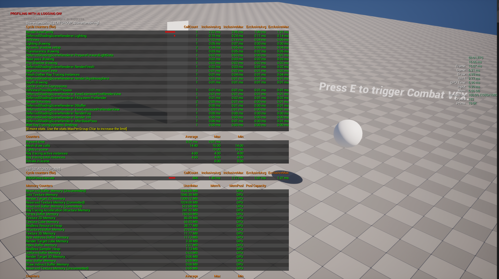

# Technical Artist Test - [Test A - Combat VFX]

**Candidate:** Lương Duy Tuấn Phong
**Test:** A - Combat VFX
**Completion Time:** 2.0 Man-Days
**UE Version:** 5.7

#🎯 Test Overview

- Created three Niagara Systems: SpellCharge, SpellCast, and SpellImpact.
- Developed a Blueprint input system using the E key to trigger and launch the spell projectile effect.
- Set up a Level Sequencer with camera animations to showcase the spell effects and exported the final result as an MP4 video.

# 🚀 Key Features

– Built Spell Charge, Spell Cast, and Spell Impact Niagara Systems with a modular effect workflow.
– Implemented E-key input to trigger projectile casting and control the VFX lifecycle.
– Created camera animation and cinematic presentation using Unreal Engine Level Sequencer and rendered the final result to MP4.

# 🎮 How to Test

1. Extract the project ZIP file.
2. Open the project using **Unreal Engine 5.7**.
3. Open and play the **TestA-CombatVFX** level.
4. Press **E** to trigger the spell-casting function and activate the Niagara VFX.

# 📊 Performance Metrics 

- Target FPS: 60 
- Achieved: 60 fps 
- Particle Count: 200 active

# 🛠 Tools & Techniques Used
- UE5 Systems: Niagara, Blueprint, Level Sequencer, Materials
- Key Workflows: Niagara System creation and configuration, Blueprint-based gameplay scripting, Level Sequencer setup, Material function

## 🎨 Media Preview

